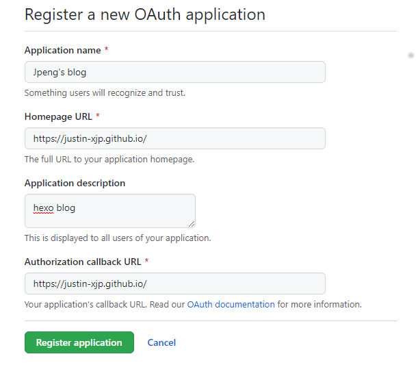

羡慕人家能评论的BLOG也不是一天两天了。也早就了解过使用GITHUB的Issue功能完成评论功能。可就是这个拖延症呀。慢性病是要命的。

本次跟着其他文章一步步做来。自己这里留个过程记录。主要是这世代变换快，好好的文章说不定哪天就不见了。

## 1.安装

我用的是`Next`主题，主题的各种效果都没有吃透，功能强大，安装很久了，目前手头的版本是8.0.2

<!--more-->

### 1.1 next配置gitalk

修改`_config.next.yml`

```
comments:
  # Available values: tabs | buttons
  style: tabs
  # Choose a comment system to be displayed by default.
  # Available values: changyan | disqus | disqusjs | gitalk | livere | valine
  active: gitalk
  # Setting `true` means remembering the comment system selected by the visitor.
  storage: true
  # Lazyload all comment systems.
  lazyload: false
  # Modify texts or order for any navs, here are some examples.
  nav:
    #disqus:
    #  text: Load Disqus
    #  order: -1
    #gitalk:
    #  order: -2
```


```
gitalk:
  enable: true
  github_id: # GitHub repo owner
  repo: # Repository name to store issues
  client_id: # GitHub Application Client ID
  client_secret: # GitHub Application Client Secret
  admin_user: # GitHub repo owner and collaborators, only these guys can initialize gitHub issues
  distraction_free_mode: true # Facebook-like distraction free mode
  # Gitalk's display language depends on user's browser or system environment
  # If you want everyone visiting your site to see a uniform language, you can set a force language value
  # Available values: en | es-ES | fr | ru | zh-CN | zh-TW
  language: zh-CN
```


其中 `client_id`和`client_secret`需要申请OAuth认证。

`repo`填自身的blog地址。

#### 申请OAuth

登录github后， 打开[New OAuth Application (github.com)](https://github.com/settings/applications/new)页面



按要求填写

最终得到 cilent_id


### 1.2 关闭特定页面的评论

比如`about`页面等功能页面，设置：

```
title: All tags
type: "tags"
comments: false
---
```

